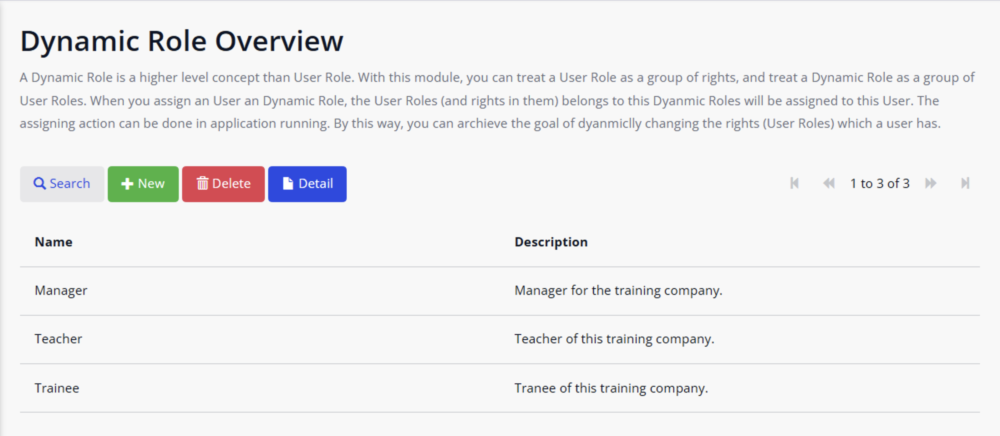

[中文文档](./README-CN.md) | [English Version](./README.md)

# mendix-dynamic-rights-authorize
A module to let you dynamic manage the rights of a role in the running stage in Mendix.

# 问题背景

在 Mendix 里，通常我们只能在开发阶段去配置角色的权限。如果想重新更改角色的权限，需要更改低代码，并重新部署应用。但是在一些复杂的应用里， 角色非常多，权限点也非常多，更改角色权限的动作很频繁。 如果每次更改角色的权限点都需要重启应用的话，那就太不方便。 有没有方法可以在不重启应用的情况下，管理角色的权限呢？本文将介绍一种新的方法达到此目的。 

# 效果展示

**Dynamic Role 列表页面：**

**角色 Manager 关联的 User 列表：**

**角色 Manager 关联的 Rights (User Role) 列表：**

# 解决方案思路

这种方法的核心思路如下：

我们创建了一个新的概念，叫做 Dynamic Role。 在新的方案下，我们不把过去的 User Role 当成 Role 来用，而仅仅当成权限点来用。在运行阶段，我们动态的调整 Dynamic Role 与权限点（User Role）的关系，即可达到动态配置角色权限点的目的。比如，以前我们的 User Role 叫做 Manager、Teacher、Trainee；而在新的方案里，我们的 User Role 可能为 TrainingEvent_Edit, TrainingEvent_ReadOnly, Course_Edit, Course_ReadOnly。

# How to Use

1. 下载 [GitHub 仓库](https://github.com/zjh1943/mendix-dynamic-rights-authorize)，打开 `demo-DynamicRoleExample.mpk` 项目进行体验。
2. 导出 `DynamicRole` Module，然后再把该 MPK 文件导入到你的 Project 中。
3. 把所有的 User Role 都改为权限点。比如，以前我们的 User Role 叫做 Manager、Teacher、Trainee。更改后，我们的 User Role 可能为 TrainingEvent_Edit, TrainingEvent_ReadOnly, Course_Edit, Course_ReadOnly。
4. 把 `DynamicRole.DynamicRole_Overview` 页面添加到 App Navigation 中去。
5. 启动 Project，打开 `DynamicRole.DynamicRole_Overview` 页面，创建 Dynamic Role。[image](./docs/Untitled%205.png)   
6. 双击新建的 Dynamic Role，管理其关联的 User 和 Rights (User Role).

# 注意事项

1. 当你使用了本 Module 去管理用户权限后，就不要再自己直接更改 User Role 与 User 之间的关联了。比如，不要用 `Administration.Account_Overview` 页面去管理 User 的 User Role。