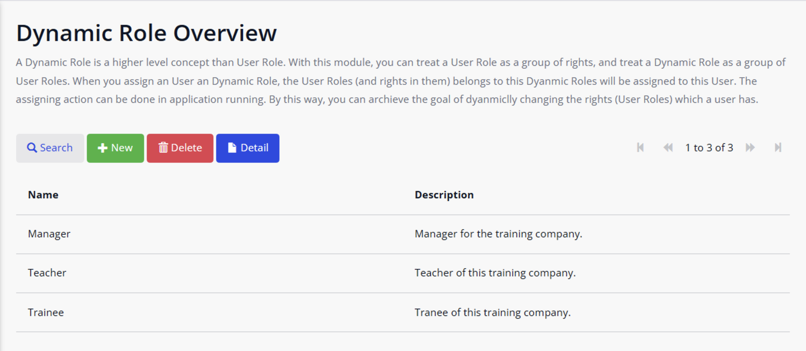

[中文文档](./README-CN.md) | [English Version](./README.md)

# mendix-dynamic-rights-authorize
A module to let you dynamic manage the rights of a role in the running stage in Mendix.

# Background

In Mendix, traditionally, we can only configure role permissions during the development phase. If you want to modify role permissions again, it requires modifying low-code and redeploying the application. However, in complex applications, there are numerous roles and a multitude of permission points, leading to frequent changes in role permissions. If restarting the application is necessary every time role permissions are changed, it becomes inconvenient. Is there a way to manage role permissions without restarting the application? This article will introduce a new approach to achieving this goal.

# Screenshots

**Dynamic Role List 👇🏻👇🏻👇🏻**

**User List Associated with the Manager Role👇🏻👇🏻👇🏻**

**Rights (User Role) List Associated with the Manager Role👇🏻👇🏻👇🏻**

# Solution Overview

The core idea of this method is as follows:

We introduce a new concept called `Dynamic Role`. In this new approach, we no longer treat User Roles from the past as roles, but solely as rights. During runtime, we dynamically adjust the relationship between Dynamic Roles and rights (User Roles) to achieve a dynamic configuration of role rights. For instance, in the past, our User Roles might have been named *Manager, Teacher, and Trainee.* While in the new approach, our User Roles might be *TrainingEvent_Edit, TrainingEvent_ReadOnly, Course_Edit, Course_ReadOnly*.

# How to Use

1. Download the [GitHub repository](https://github.com/zjh1943/mendix-dynamic-rights-authorize) and open the `demo-DynamicRoleExample.mpk` project for experimentation.
2. Export the `DynamicRole` module and then import the MPK file into your project.
3. Convert all names of User Roles into rights. For example, previously our User Roles were *Manager, Teacher, Trainee*. After the change, our User Roles might become *TrainingEvent_Edit, TrainingEvent_ReadOnly, Course_Edit, Course_ReadOnly*.
4. Add the `DynamicRole.DynamicRole_Overview` page to the App Navigation.
5. Start the project, and open the `DynamicRole.DynamicRole_Overview` page, and create Dynamic Roles.
6. Double-click on the newly created Dynamic Role to manage its associated Users and Rights (User Roles).

# Important Notes

1. After you have utilized this module to manage rights of roles, avoid making direct changes to the association between User Roles and Users. For instance, refrain from using the `Administration.Account_Overview` page to manage User Roles for Users.